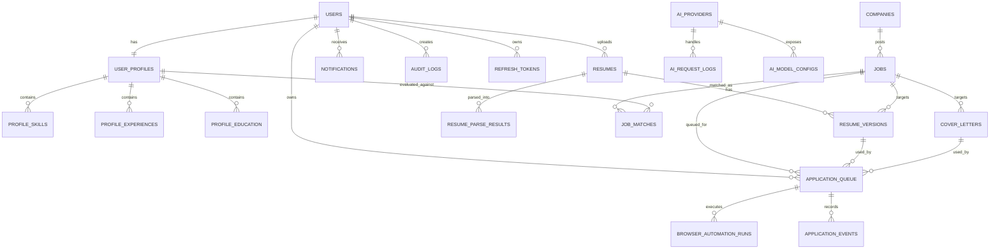

# JobPilot AI Backend Architecture

## 1. Purpose

JobPilot AI is an autonomous AI job agent. The backend must support a user uploading a resume once, extracting structured profile data, discovering jobs across supported sources, matching jobs against the user profile, generating tailored resume versions and cover letters, preparing applications, and later coordinating browser automation and multiple AI providers.

This document is the backend blueprint. It defines architecture, module boundaries, persistence design, integration layers, conventions, and operational strategy. It intentionally does not define controller code or business logic implementation.

## 2. Technology Baseline

- Java 21
- Spring Boot 3.x
- Spring Security
- JWT access and refresh tokens
- Spring Data JPA
- Hibernate
- MySQL
- Redis, planned for cache, rate limiting, queues, locks, and token/session state
- Lombok
- MapStruct
- Jakarta Bean Validation
- Docker-ready deployment

## 3. Architectural Style

Use a modular monolith as the first backend architecture.

The system should be packaged by business capability, not by technical layer alone. Each module owns its domain model, repositories, services, DTOs, mappers, and integration contracts where appropriate. Shared infrastructure remains under `common`, `config`, and `security`.

This gives the project enough structure to scale while avoiding premature distributed-system complexity. Future extraction to services should be possible around stable module boundaries such as AI orchestration, browser automation, notification delivery, and job ingestion.

## 4. Folder Structure

```text
Backend/
  pom.xml
  Dockerfile
  docker-compose.yml
  .env.example
  src/
    main/
      java/
        com/jobpilotai/backend/
          JobPilotBackendApplication.java
          auth/
          user/
          profile/
          resume/
          resumeversion/
          resumeparser/
          job/
          company/
          matching/
          tailoring/
          coverletter/
          applicationqueue/
          browserautomation/
          ai/
          notification/
          email/
          scheduler/
          audit/
          security/
          config/
          common/
      resources/
        application.yml
        application-dev.yml
        application-prod.yml
        db/
          migration/
            V1__init_schema.sql
            V2__add_indexes.sql
        templates/
          email/
          cover-letter/
        logback-spring.xml
    test/
      java/
        com/jobpilotai/backend/
          auth/
          user/
          profile/
          resume/
          job/
          matching/
          ai/
          support/
```

## 5. Package Structure

Use this package pattern inside each business module:

```text
com.jobpilotai.backend.<module>/
  domain/
    entity/
    enumtype/
    valueobject/
  dto/
    request/
    response/
    internal/
  mapper/
  repository/
  service/
    command/
    query/
    orchestration/
  exception/
  event/
```

Shared packages:

```text
com.jobpilotai.backend.common/
  api/
  exception/
  validation/
  pagination/
  event/
  util/
  constants/

com.jobpilotai.backend.security/
  jwt/
  filter/
  principal/
  service/
  config/

com.jobpilotai.backend.config/
  persistence/
  async/
  scheduling/
  cache/
  storage/
  openapi/
  cors/
```

## 6. Module Responsibilities

| Module | Responsibility |
| --- | --- |
| Auth | Registration, login, refresh token lifecycle, logout, password reset contracts |
| Users | Core user account, status, roles, preferences |
| Profiles | Structured candidate profile derived from resume and user edits |
| Resume | Original resume upload metadata and storage references |
| Resume Version | Tailored/generated resume variants per job/application |
| Resume Parser | AI or parser-backed extraction of structured resume data |
| Jobs | Imported or discovered job postings from supported sources |
| Companies | Company records, metadata, career page references |
| Matching | Job-to-profile match scores, explanations, skill gaps |
| Resume Tailoring | Tailoring instructions, generated artifacts, version history |
| Cover Letter | Company/job-specific cover letter generation and versioning |
| Application Queue | Planned, pending, submitted, failed, and retriable applications |
| Browser Automation | Future automation jobs, browser sessions, step logs, screenshots |
| AI Orchestrator | Provider-independent AI request routing and workflow coordination |
| Notifications | In-app notifications and user notification preferences |
| Email | Transactional and workflow email delivery |
| Scheduler | Recurring job searches, retries, cleanup, reminders |
| AI Provider | Provider configuration, model capabilities, usage tracking |
| Audit Logs | Security and business-event audit trail |

## 7. Entity Relationship Diagram



## 8. Database Schema

Use `BIGINT` primary keys with auto-increment for internal records. Use `UUID` public identifiers for externally exposed resource IDs where needed. All tables should include `created_at`, `updated_at`, and optional `deleted_at` for soft deletion where records are user-owned or audit-sensitive.

### users

| Column | Type | Notes |
| --- | --- | --- |
| id | BIGINT PK | Internal ID |
| public_id | CHAR(36) UNIQUE | External-safe identifier |
| email | VARCHAR(255) UNIQUE NOT NULL | Login identity |
| password_hash | VARCHAR(255) NOT NULL | BCrypt or Argon2 hash |
| full_name | VARCHAR(150) | Display name |
| role | VARCHAR(50) NOT NULL | `USER`, `ADMIN` |
| status | VARCHAR(50) NOT NULL | `ACTIVE`, `LOCKED`, `DISABLED`, `PENDING_VERIFICATION` |
| email_verified | BOOLEAN NOT NULL | Default false |
| last_login_at | DATETIME | Last successful login |
| created_at | DATETIME NOT NULL | Audit timestamp |
| updated_at | DATETIME NOT NULL | Audit timestamp |

### refresh_tokens

| Column | Type | Notes |
| --- | --- | --- |
| id | BIGINT PK | Internal ID |
| user_id | BIGINT FK | Owner |
| token_hash | VARCHAR(255) UNIQUE NOT NULL | Never store raw token |
| expires_at | DATETIME NOT NULL | Expiry |
| revoked_at | DATETIME | Revocation marker |
| created_at | DATETIME NOT NULL | Issued time |

### user_profiles

| Column | Type | Notes |
| --- | --- | --- |
| id | BIGINT PK | Internal ID |
| user_id | BIGINT UNIQUE FK | One profile per user |
| headline | VARCHAR(255) | Candidate headline |
| summary | TEXT | Candidate summary |
| location | VARCHAR(150) | User location |
| target_roles | JSON | Desired roles |
| target_locations | JSON | Desired locations |
| remote_preference | VARCHAR(50) | `REMOTE`, `HYBRID`, `ONSITE`, `ANY` |
| years_experience | DECIMAL(4,1) | Derived or user-provided |
| created_at | DATETIME NOT NULL | Audit timestamp |
| updated_at | DATETIME NOT NULL | Audit timestamp |

### profile_skills

| Column | Type | Notes |
| --- | --- | --- |
| id | BIGINT PK | Internal ID |
| profile_id | BIGINT FK | Profile |
| skill_name | VARCHAR(120) NOT NULL | Normalized skill |
| category | VARCHAR(80) | Language, framework, cloud, tool |
| proficiency | VARCHAR(50) | Optional level |
| source | VARCHAR(50) | `RESUME`, `USER`, `AI` |

### profile_experiences

| Column | Type | Notes |
| --- | --- | --- |
| id | BIGINT PK | Internal ID |
| profile_id | BIGINT FK | Profile |
| company_name | VARCHAR(180) | Employer |
| title | VARCHAR(180) | Role |
| start_date | DATE | Start |
| end_date | DATE | End |
| current | BOOLEAN | Current role flag |
| description | TEXT | Normalized details |
| achievements | JSON | Bullet achievements |

### profile_education

| Column | Type | Notes |
| --- | --- | --- |
| id | BIGINT PK | Internal ID |
| profile_id | BIGINT FK | Profile |
| institution | VARCHAR(180) | School |
| degree | VARCHAR(180) | Degree |
| field_of_study | VARCHAR(180) | Field |
| start_date | DATE | Start |
| end_date | DATE | End |

### resumes

| Column | Type | Notes |
| --- | --- | --- |
| id | BIGINT PK | Internal ID |
| user_id | BIGINT FK | Owner |
| original_filename | VARCHAR(255) NOT NULL | Uploaded name |
| file_type | VARCHAR(50) NOT NULL | PDF, DOCX |
| storage_key | VARCHAR(500) NOT NULL | Local/S3/blob reference |
| checksum | VARCHAR(128) | Duplicate detection |
| active | BOOLEAN NOT NULL | Default resume marker |
| uploaded_at | DATETIME NOT NULL | Upload time |
| created_at | DATETIME NOT NULL | Audit timestamp |

### resume_parse_results

| Column | Type | Notes |
| --- | --- | --- |
| id | BIGINT PK | Internal ID |
| resume_id | BIGINT FK | Source resume |
| parser_type | VARCHAR(80) | AI, library, hybrid |
| status | VARCHAR(50) | `PENDING`, `SUCCESS`, `FAILED` |
| raw_text | LONGTEXT | Extracted text |
| structured_json | JSON | Parsed structured data |
| confidence_score | DECIMAL(5,2) | Parser confidence |
| error_message | TEXT | Failure details |
| created_at | DATETIME NOT NULL | Audit timestamp |

### companies

| Column | Type | Notes |
| --- | --- | --- |
| id | BIGINT PK | Internal ID |
| name | VARCHAR(200) NOT NULL | Company name |
| website_url | VARCHAR(500) | Website |
| careers_url | VARCHAR(500) | Careers page |
| industry | VARCHAR(150) | Industry |
| size_range | VARCHAR(80) | Company size |
| location | VARCHAR(180) | HQ or primary location |
| source | VARCHAR(80) | Origin |

### jobs

| Column | Type | Notes |
| --- | --- | --- |
| id | BIGINT PK | Internal ID |
| public_id | CHAR(36) UNIQUE | External-safe identifier |
| company_id | BIGINT FK | Company |
| title | VARCHAR(255) NOT NULL | Job title |
| description | LONGTEXT | Full job description |
| location | VARCHAR(180) | Location |
| remote_type | VARCHAR(50) | Remote/hybrid/onsite |
| employment_type | VARCHAR(50) | Full-time, contract |
| salary_min | DECIMAL(12,2) | Optional |
| salary_max | DECIMAL(12,2) | Optional |
| currency | VARCHAR(10) | Salary currency |
| source | VARCHAR(80) NOT NULL | LinkedIn, Indeed, company site, etc. |
| source_job_id | VARCHAR(255) | Source-specific ID |
| source_url | VARCHAR(1000) | Posting URL |
| status | VARCHAR(50) | `ACTIVE`, `EXPIRED`, `DUPLICATE`, `IGNORED` |
| posted_at | DATETIME | Posted date |
| discovered_at | DATETIME NOT NULL | Discovery time |

### job_matches

| Column | Type | Notes |
| --- | --- | --- |
| id | BIGINT PK | Internal ID |
| user_id | BIGINT FK | User |
| profile_id | BIGINT FK | Profile version evaluated |
| job_id | BIGINT FK | Job |
| score | DECIMAL(5,2) NOT NULL | Match score |
| verdict | VARCHAR(50) | `STRONG`, `GOOD`, `WEAK`, `REJECTED` |
| matched_skills | JSON | Positive signals |
| missing_skills | JSON | Gaps |
| explanation | TEXT | Human-readable reason |
| ai_request_log_id | BIGINT FK | Optional trace |
| created_at | DATETIME NOT NULL | Audit timestamp |

### resume_versions

| Column | Type | Notes |
| --- | --- | --- |
| id | BIGINT PK | Internal ID |
| user_id | BIGINT FK | Owner |
| resume_id | BIGINT FK | Source resume |
| job_id | BIGINT FK | Target job |
| version_name | VARCHAR(180) | Display label |
| storage_key | VARCHAR(500) | Generated document reference |
| content_json | JSON | Structured tailored content |
| status | VARCHAR(50) | `DRAFT`, `READY`, `FAILED`, `ARCHIVED` |
| ai_request_log_id | BIGINT FK | Optional trace |
| created_at | DATETIME NOT NULL | Audit timestamp |

### cover_letters

| Column | Type | Notes |
| --- | --- | --- |
| id | BIGINT PK | Internal ID |
| user_id | BIGINT FK | Owner |
| job_id | BIGINT FK | Target job |
| company_id | BIGINT FK | Target company |
| title | VARCHAR(180) | Display label |
| content | LONGTEXT | Generated content |
| status | VARCHAR(50) | `DRAFT`, `READY`, `FAILED`, `ARCHIVED` |
| ai_request_log_id | BIGINT FK | Optional trace |
| created_at | DATETIME NOT NULL | Audit timestamp |

### application_queue

| Column | Type | Notes |
| --- | --- | --- |
| id | BIGINT PK | Internal ID |
| user_id | BIGINT FK | Owner |
| job_id | BIGINT FK | Target job |
| resume_version_id | BIGINT FK | Resume artifact |
| cover_letter_id | BIGINT FK | Cover letter artifact |
| status | VARCHAR(50) | `PREPARED`, `QUEUED`, `IN_PROGRESS`, `SUBMITTED`, `FAILED`, `CANCELLED` |
| priority | INT | Queue ordering |
| scheduled_at | DATETIME | Planned execution |
| submitted_at | DATETIME | Submission timestamp |
| failure_reason | TEXT | Last failure |
| retry_count | INT NOT NULL | Default 0 |
| created_at | DATETIME NOT NULL | Audit timestamp |
| updated_at | DATETIME NOT NULL | Audit timestamp |

### application_events

| Column | Type | Notes |
| --- | --- | --- |
| id | BIGINT PK | Internal ID |
| application_id | BIGINT FK | Application queue item |
| event_type | VARCHAR(80) | State transition |
| message | TEXT | Details |
| metadata | JSON | Structured context |
| created_at | DATETIME NOT NULL | Event time |

### browser_automation_runs

| Column | Type | Notes |
| --- | --- | --- |
| id | BIGINT PK | Internal ID |
| application_id | BIGINT FK | Related application |
| status | VARCHAR(50) | `PENDING`, `RUNNING`, `SUCCESS`, `FAILED`, `NEEDS_USER` |
| provider | VARCHAR(80) | Playwright, remote browser, etc. |
| session_id | VARCHAR(255) | External session |
| step_log | JSON | Step-level execution trace |
| screenshot_storage_key | VARCHAR(500) | Optional evidence |
| error_message | TEXT | Failure |
| started_at | DATETIME | Start |
| finished_at | DATETIME | End |

### ai_providers

| Column | Type | Notes |
| --- | --- | --- |
| id | BIGINT PK | Internal ID |
| name | VARCHAR(100) UNIQUE NOT NULL | Provider name |
| status | VARCHAR(50) | `ACTIVE`, `DISABLED` |
| base_url | VARCHAR(500) | Provider endpoint |
| config_json | JSON | Non-secret config |
| created_at | DATETIME NOT NULL | Audit timestamp |

### ai_model_configs

| Column | Type | Notes |
| --- | --- | --- |
| id | BIGINT PK | Internal ID |
| provider_id | BIGINT FK | Provider |
| model_name | VARCHAR(150) NOT NULL | Model |
| capability | VARCHAR(80) | `PARSING`, `MATCHING`, `TAILORING`, `COVER_LETTER` |
| max_tokens | INT | Provider limit |
| enabled | BOOLEAN | Availability |

### ai_request_logs

| Column | Type | Notes |
| --- | --- | --- |
| id | BIGINT PK | Internal ID |
| provider_id | BIGINT FK | Provider |
| user_id | BIGINT FK | Optional owner |
| use_case | VARCHAR(80) | Parser, matcher, tailoring |
| model_name | VARCHAR(150) | Model used |
| prompt_hash | VARCHAR(128) | Prompt trace without storing sensitive content |
| input_tokens | INT | Usage |
| output_tokens | INT | Usage |
| cost_estimate | DECIMAL(12,6) | Optional |
| status | VARCHAR(50) | Success/failure |
| latency_ms | INT | Timing |
| error_message | TEXT | Failure details |
| created_at | DATETIME NOT NULL | Request time |

### notifications

| Column | Type | Notes |
| --- | --- | --- |
| id | BIGINT PK | Internal ID |
| user_id | BIGINT FK | Recipient |
| type | VARCHAR(80) | Notification type |
| title | VARCHAR(180) | Title |
| message | TEXT | Body |
| read_at | DATETIME | Read marker |
| metadata | JSON | Context |
| created_at | DATETIME NOT NULL | Created time |

### email_outbox

| Column | Type | Notes |
| --- | --- | --- |
| id | BIGINT PK | Internal ID |
| user_id | BIGINT FK | Optional recipient owner |
| to_email | VARCHAR(255) NOT NULL | Recipient |
| subject | VARCHAR(255) NOT NULL | Subject |
| template_name | VARCHAR(150) | Template |
| payload_json | JSON | Template data |
| status | VARCHAR(50) | `PENDING`, `SENT`, `FAILED` |
| retry_count | INT NOT NULL | Default 0 |
| sent_at | DATETIME | Sent timestamp |
| created_at | DATETIME NOT NULL | Created time |

### audit_logs

| Column | Type | Notes |
| --- | --- | --- |
| id | BIGINT PK | Internal ID |
| user_id | BIGINT FK | Actor, nullable for system |
| action | VARCHAR(120) NOT NULL | Action name |
| entity_type | VARCHAR(120) | Target type |
| entity_id | VARCHAR(120) | Target ID |
| ip_address | VARCHAR(80) | Request IP |
| user_agent | VARCHAR(500) | Request agent |
| metadata | JSON | Additional context |
| created_at | DATETIME NOT NULL | Event time |

## 9. Key Indexes and Constraints

- `users.email` unique.
- `users.public_id` unique.
- `refresh_tokens.token_hash` unique.
- `user_profiles.user_id` unique.
- `jobs.public_id` unique.
- `jobs(source, source_job_id)` unique where source job IDs are reliable.
- `jobs(company_id, title, location)` indexed for deduplication support.
- `job_matches(user_id, job_id)` unique to avoid duplicate match rows.
- `application_queue(user_id, job_id)` unique for active applications.
- `application_queue(status, scheduled_at)` indexed for scheduler polling.
- `notifications(user_id, read_at, created_at)` indexed.
- `audit_logs(user_id, created_at)` indexed.
- All foreign keys should be indexed.

## 10. Authentication Flow

1. User registers with email and password.
2. Backend validates input, hashes password, creates user with default role `USER`.
3. User logs in with credentials.
4. Authentication manager verifies credentials.
5. Backend issues short-lived JWT access token and long-lived refresh token.
6. Raw refresh token is returned once; only its hash is stored.
7. Access token is sent in `Authorization: Bearer <token>`.
8. JWT filter validates signature, expiry, issuer, audience, and subject.
9. Security context is populated with a custom principal containing user ID, public ID, email, role, and status.
10. Refresh endpoint rotates refresh tokens and revokes the previous token.
11. Logout revokes the active refresh token.
12. Disabled or locked users are rejected even if token signature is valid.

Recommended token policy:

- Access token: 10 to 20 minutes.
- Refresh token: 7 to 30 days depending on product policy.
- Refresh token rotation on every refresh.
- Store JWT signing secrets in environment variables or a secret manager.
- Prefer asymmetric signing later if multiple services need token verification.

## 11. API Response Format

Use one consistent envelope for all non-streaming REST responses.

Success:

```json
{
  "success": true,
  "data": {},
  "message": "Request completed successfully",
  "timestamp": "2026-07-05T10:30:00Z",
  "traceId": "01J..."
}
```

Paginated success:

```json
{
  "success": true,
  "data": [],
  "page": {
    "number": 0,
    "size": 20,
    "totalElements": 125,
    "totalPages": 7,
    "first": true,
    "last": false
  },
  "timestamp": "2026-07-05T10:30:00Z",
  "traceId": "01J..."
}
```

Error:

```json
{
  "success": false,
  "error": {
    "code": "VALIDATION_FAILED",
    "message": "Request validation failed",
    "details": [
      {
        "field": "email",
        "message": "must be a valid email address"
      }
    ]
  },
  "timestamp": "2026-07-05T10:30:00Z",
  "traceId": "01J..."
}
```

## 12. Exception Handling Strategy

Use a global `@RestControllerAdvice` and a small set of domain-specific exceptions.

Base exception categories:

| Exception | HTTP Status | Error Code |
| --- | --- | --- |
| Validation failure | 400 | `VALIDATION_FAILED` |
| Authentication failure | 401 | `AUTHENTICATION_FAILED` |
| Access denied | 403 | `ACCESS_DENIED` |
| Resource not found | 404 | `RESOURCE_NOT_FOUND` |
| Duplicate resource | 409 | `RESOURCE_CONFLICT` |
| Invalid state transition | 409 | `INVALID_STATE_TRANSITION` |
| Rate limit exceeded | 429 | `RATE_LIMIT_EXCEEDED` |
| AI provider failure | 502 | `AI_PROVIDER_FAILURE` |
| Browser automation failure | 502 | `AUTOMATION_FAILURE` |
| Unexpected server error | 500 | `INTERNAL_SERVER_ERROR` |

Rules:

- Do not leak stack traces or provider secrets in API responses.
- Include `traceId` in every error response.
- Log unexpected exceptions with stack traces.
- Log expected domain errors at `WARN` or `INFO` depending on severity.
- Convert provider-specific errors into stable application error codes.

## 13. Validation Strategy

Use layered validation:

- DTO validation with Jakarta Bean Validation annotations.
- Domain validation inside service/domain methods for state transitions.
- Database constraints for uniqueness and referential integrity.
- File validation for resume upload type, size, checksum, and malware scanning hook.
- Enum validation for statuses, sources, remote preference, and application states.
- Cross-field validation through custom validators where needed.

Recommended custom validators:

- Valid password policy.
- Valid file type.
- Valid salary range.
- Valid scheduled time.
- Valid application state transition.
- Valid supported AI capability.

## 14. Service Layer Architecture

Separate services by intent:

- Command services mutate state.
- Query services read and compose data.
- Orchestration services coordinate multi-step workflows.
- Integration services call external systems.

Example service layout:

```text
resume/service/
  ResumeCommandService
  ResumeQueryService
  ResumeStorageService

matching/service/
  JobMatchingCommandService
  JobMatchingQueryService
  JobMatchingOrchestrator

applicationqueue/service/
  ApplicationQueueCommandService
  ApplicationQueueQueryService
  ApplicationPreparationOrchestrator
```

Transaction rules:

- Keep database transactions short.
- Do not hold DB transactions open while calling AI providers, email providers, or browser automation.
- Persist workflow intent first, then execute external work asynchronously where possible.
- Use idempotency keys for retryable workflows.
- Use application events or an outbox pattern for cross-module side effects.

## 15. Repository Layer

Use Spring Data JPA repositories for aggregate persistence.

Guidelines:

- Repositories return entities, not DTOs, unless using explicit read projections.
- Use query methods for simple lookups.
- Use `@Query` for complex joins.
- Use specifications or criteria only when filters become dynamic.
- Avoid exposing repositories directly to controllers.
- Use optimistic locking for records with workflow state, such as application queue items and browser automation runs.
- Prefer read-only transactions for query services.

Important repositories:

- `UserRepository`
- `RefreshTokenRepository`
- `UserProfileRepository`
- `ResumeRepository`
- `ResumeVersionRepository`
- `ResumeParseResultRepository`
- `CompanyRepository`
- `JobRepository`
- `JobMatchRepository`
- `CoverLetterRepository`
- `ApplicationQueueRepository`
- `BrowserAutomationRunRepository`
- `AiProviderRepository`
- `AiRequestLogRepository`
- `NotificationRepository`
- `EmailOutboxRepository`
- `AuditLogRepository`

## 16. DTO Layer

DTOs should be explicit and use request/response boundaries.

DTO categories:

- Request DTOs: input validation and API command payloads.
- Response DTOs: API output contracts.
- Internal DTOs: module-to-module data transfer.
- Provider DTOs: external AI/browser/email request and response models.

Rules:

- Do not expose JPA entities directly.
- Do not include sensitive fields like password hash, token hash, provider API keys, or raw prompts in response DTOs.
- Use public IDs in external DTOs when practical.
- Use dedicated summary DTOs for lists.
- Use detail DTOs for single-resource responses.

## 17. Mapper Layer

Use MapStruct for deterministic entity-to-DTO mapping.

Guidelines:

- Mappers should be stateless.
- Mappers should not call repositories.
- Mappers should not contain business decisions.
- Complex enrichment belongs in query services.
- Use explicit mapping for nested objects and enum conversions.
- Keep AI/provider mapping in integration-specific mapper classes.

Package examples:

```text
job/mapper/JobMapper
resume/mapper/ResumeMapper
matching/mapper/JobMatchMapper
applicationqueue/mapper/ApplicationQueueMapper
ai/mapper/AiProviderMapper
```

## 18. AI Integration Layer

AI should be accessed through provider-independent interfaces. Business modules should never call OpenAI, Anthropic, local models, or any other provider directly.

Suggested structure:

```text
ai/
  provider/
    AiProviderClient
    AiProviderRegistry
    AiProviderCapability
  orchestrator/
    AiOrchestrator
    ResumeParsingAiWorkflow
    JobMatchingAiWorkflow
    ResumeTailoringAiWorkflow
    CoverLetterAiWorkflow
  prompt/
    PromptTemplateRegistry
    PromptVersion
  dto/
    AiRequest
    AiResponse
    AiUsage
  policy/
    AiRetryPolicy
    AiFallbackPolicy
    AiCostPolicy
  logging/
    AiRequestLogger
```

Core principles:

- Provider selection is configuration-driven.
- Store prompt versions and hashes for traceability.
- Avoid storing raw resume or prompt content in logs unless explicitly required and protected.
- Track token usage, latency, provider, model, use case, and failures.
- Support fallback providers per capability.
- Support mock provider for local development and tests.
- Separate synchronous request/response use cases from long-running AI workflows.

Initial AI capabilities:

- Resume parsing.
- Job description normalization.
- Job matching.
- Resume tailoring.
- Cover letter generation.
- Application question answering, future.

## 19. Browser Automation Layer

Browser automation should be isolated behind an automation gateway. It is high-risk, stateful, and likely to evolve separately from the main API.

Suggested structure:

```text
browserautomation/
  gateway/
    BrowserAutomationGateway
    BrowserSessionGateway
  workflow/
    ApplicationAutomationWorkflow
    CareerSiteNavigationWorkflow
  dto/
    AutomationRequest
    AutomationResult
    AutomationStepResult
  service/
    BrowserAutomationCommandService
    BrowserAutomationQueryService
  policy/
    AutomationRetryPolicy
    HumanInterventionPolicy
```

Design rules:

- Never let controllers talk directly to browser drivers.
- Persist automation intent before execution.
- Persist step logs and screenshots only when needed.
- Mark flows as `NEEDS_USER` when CAPTCHA, MFA, ambiguous forms, or payment/security prompts appear.
- Use idempotent application submission guards.
- Use rate limits and source-specific policies.
- Run automation in a separate worker process or service when scale requires it.

## 20. Scheduler Layer

Use Spring Scheduling initially. Design so scheduled work can later move to Quartz, Redis queues, RabbitMQ, Kafka, or a worker service.

Scheduled jobs:

- Job discovery polling.
- Job matching for newly discovered jobs.
- Application queue execution.
- Retry failed AI workflows.
- Retry email outbox.
- Cleanup expired refresh tokens.
- Cleanup stale uploaded temporary files.
- Notification digest generation.
- Audit retention processing.

Rules:

- Use distributed locks when multiple backend instances are deployed.
- Redis can provide future lock support.
- Scheduled jobs should operate in small batches.
- Scheduler should use statuses and timestamps, not in-memory state.
- Every scheduled job should be safe to retry.

## 21. Notification Layer

Notifications represent user-visible product events.

Notification types:

- Resume parsed.
- New strong job match found.
- Resume tailoring completed.
- Cover letter completed.
- Application prepared.
- Application submitted.
- Application failed.
- User action required.

Design:

- Store notifications in the database.
- Use read/unread status.
- Keep metadata structured in JSON.
- Allow future WebSocket or Server-Sent Events delivery.
- Allow user preferences for notification channels.

## 22. Email Layer

Use an email outbox table to decouple business workflows from delivery.

Email types:

- Email verification.
- Password reset.
- Application status digest.
- User action required.
- Weekly job match summary.

Design:

- Business service writes an `email_outbox` row.
- Email scheduler/worker sends pending rows.
- Sent and failed states are persisted.
- Retry count and last failure should be tracked.
- Templates live under `resources/templates/email`.
- Provider-specific clients are hidden behind an `EmailSender` interface.

## 23. Logging Strategy

Use structured logging.

Log fields:

- `traceId`
- `userId`, when authenticated
- `requestMethod`
- `requestPath`
- `statusCode`
- `durationMs`
- `module`
- `workflowId`, where applicable
- `applicationId`, where applicable
- `aiProvider`, `aiModel`, and `aiUseCase`, where applicable

Rules:

- Do not log passwords, tokens, raw provider secrets, or full resume text.
- Redact email content and AI prompts unless explicitly configured for secure debugging.
- Use correlation IDs across async workflows.
- Use `INFO` for workflow state changes.
- Use `WARN` for recoverable failures.
- Use `ERROR` for unexpected failures.

## 24. Configuration Structure

Use typed configuration properties.

```text
config/
  SecurityProperties
  JwtProperties
  StorageProperties
  AiProperties
  EmailProperties
  SchedulerProperties
  CorsProperties
  BrowserAutomationProperties
```

Example configuration groups:

```yaml
jobpilot:
  security:
    jwt:
      issuer: jobpilot-ai
      access-token-minutes: 15
      refresh-token-days: 14
  storage:
    provider: local
    local-path: ./data/uploads
  ai:
    default-provider: mock
    request-timeout-seconds: 60
  scheduler:
    application-queue-batch-size: 20
  email:
    provider: noop
```

Profiles:

- `dev`: local MySQL, local file storage, mock/noop providers.
- `test`: isolated database or Testcontainers, mock external integrations.
- `prod`: real secrets, production database, persistent storage, real email provider.

## 25. Security Architecture

Security rules:

- JWT authentication for protected APIs.
- Role-based authorization for admin endpoints.
- User-owned resources must be checked by owner ID.
- Passwords are hashed using BCrypt or Argon2.
- Refresh tokens are hashed at rest.
- CORS is environment-specific.
- File uploads are restricted by size and type.
- AI and automation provider keys are never stored in source control.
- Admin and automation operations should be audit logged.

Future security additions:

- Email verification enforcement.
- Account lockout after repeated failed logins.
- Device/session management.
- OAuth login.
- Two-factor authentication.
- Fine-grained permissions for team accounts.

## 26. Storage Strategy

Files to store:

- Original resumes.
- Generated tailored resumes.
- Generated cover letter exports.
- Browser automation screenshots, if enabled.

Initial storage:

- Local filesystem for development.
- Abstract through `FileStorageService`.

Future storage:

- S3-compatible object storage.
- Signed URLs for secure downloads.
- Virus scanning pipeline.
- Retention policies for old generated artifacts.

## 27. Events and Workflow Boundaries

Use domain/application events to decouple modules.

Candidate events:

- `UserRegisteredEvent`
- `ResumeUploadedEvent`
- `ResumeParsedEvent`
- `ProfileUpdatedEvent`
- `JobDiscoveredEvent`
- `JobMatchedEvent`
- `ResumeTailoringCompletedEvent`
- `CoverLetterGeneratedEvent`
- `ApplicationPreparedEvent`
- `ApplicationSubmittedEvent`
- `ApplicationFailedEvent`

Initial implementation can use Spring application events inside one process. For stronger reliability, move to a transactional outbox and external message broker later.

## 28. Future Scalability

Planned scaling path:

1. Modular monolith with clean boundaries.
2. Add Redis for caching, rate limiting, distributed locks, and async queues.
3. Add outbox pattern for reliable async workflows.
4. Split browser automation into a worker service.
5. Split AI orchestration into a dedicated service if load or provider complexity grows.
6. Add queue infrastructure for long-running jobs.
7. Add read models for dashboards and reporting.
8. Add search index for jobs and companies if MySQL filtering becomes insufficient.

Scale-sensitive areas:

- Resume parsing.
- Job ingestion.
- Job matching.
- AI generation workflows.
- Browser automation.
- Notification and email fanout.

## 29. Testing Strategy

Test layers:

- Unit tests for validators, mappers, and domain state transitions.
- Service tests for command/query behavior.
- Repository tests with Testcontainers MySQL.
- Security tests for JWT and authorization rules.
- Contract tests for API response envelopes.
- Integration tests with mock AI, email, and automation providers.
- Scheduler tests for retry and batch behavior.

External providers should be mocked by default in automated tests.

## 30. Docker Readiness

Expected runtime containers:

- Backend Spring Boot application.
- MySQL.
- Redis, future.
- Browser automation worker, future.

Docker rules:

- Runtime config comes from environment variables.
- No secrets in images.
- Upload/storage volume mounted in development.
- Health endpoint exposed for orchestration.
- Database migrations run automatically on startup or as a deployment step.

## 31. Recommended Implementation Order

1. Project scaffolding, common response envelope, exception handling, validation, logging.
2. Auth, users, JWT, refresh tokens, security configuration.
3. Profile and resume upload metadata with storage abstraction.
4. Resume parser module with mock AI provider.
5. Company and job persistence.
6. Matching module with mock AI provider.
7. Resume tailoring and cover letter modules.
8. Application queue and application events.
9. Notification and email outbox.
10. Scheduler for queued workflows.
11. Real AI provider adapters.
12. Browser automation gateway and worker integration.

## 32. Non-Goals for Initial Backend

- No direct browser automation inside controllers.
- No provider-specific AI calls inside business services.
- No JPA entities exposed as API responses.
- No long-running external calls inside open database transactions.
- No hardcoded secrets.
- No distributed microservices until module boundaries and workloads justify extraction.

